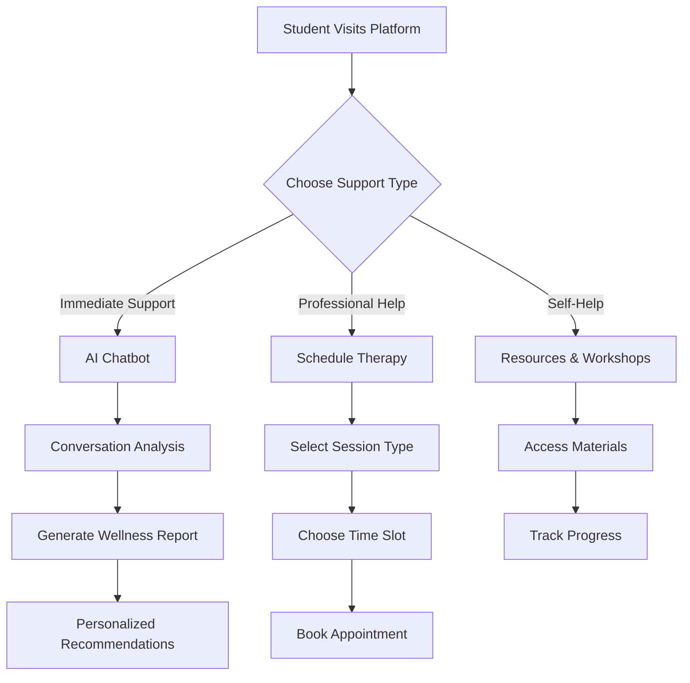
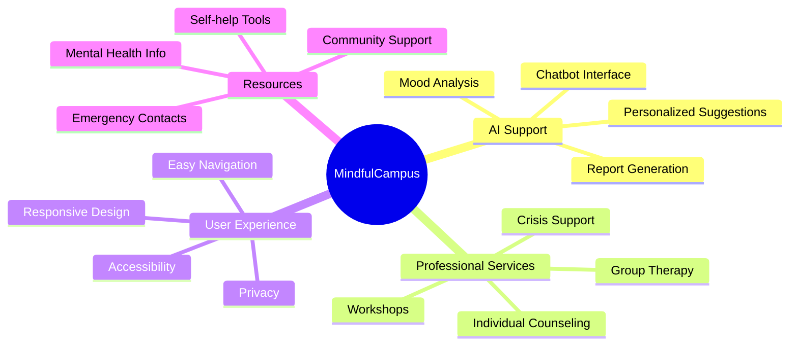

# MindfulCampus: AI-Powered Mental Health Support Platform


MindfulCampus is an innovative mental health support platform designed specifically for students. It combines AI-powered chat therapy, professional counseling services, and personalized wellness tracking to provide comprehensive mental health support in an accessible, user-friendly format.

## 🔄 Workflow Diagram



## 🗺️ Concept Map



## 🛠️ Tech Stack

### Frontend
- **React 18** - Modern UI library
- **TypeScript** - Type-safe development
- **Tailwind CSS** - Utility-first styling
- **Vite** - Next-generation frontend tooling
- **Lucide React** - Beautiful, consistent icons

### Features
- **Real-time Chat** - Instant AI therapy support
- **Appointment Scheduling** - Seamless booking system
- **Responsive Design** - Mobile-first approach
- **Interactive UI** - Smooth user experience
- **Accessibility** - WCAG compliant

## 🎯 Novelty

1. **AI-Powered Conversation Analysis**
   - Real-time mood detection
   - Context-aware responses
   - Personalized suggestion generation

2. **Comprehensive Wellness Reports**
   - Mood tracking
   - Concern identification
   - Actionable recommendations
   - Resource matching

3. **Hybrid Support System**
   - Immediate AI assistance
   - Professional therapy integration
   - Self-help resources
   - Crisis intervention

4. **Student-Centric Design**
   - Academic stress focus
   - Flexible scheduling
   - Peer support integration
   - Resource accessibility

## 💡 Solution Architecture

### Core Components

1. **Chatbot Module**
   ```typescript
   interface ChatSystem {
     AI Analysis: {
       Mood Detection
       Concern Identification
       Response Generation
     }
     Report Generation: {
       Wellness Assessment
       Personalized Suggestions
       Resource Recommendations
     }
   }
   ```

2. **Therapy Booking System**
   ```typescript
   interface BookingSystem {
     Session Types: {
       Individual
       Group
       Workshop
     }
     Scheduling: {
       Availability Check
       Time Slot Selection
       Confirmation
     }
   }
   ```

### Key Features

1. **Mental Health Support**
   - 24/7 AI chatbot availability
   - Professional counseling services
   - Crisis intervention protocols
   - Self-help resources

2. **User Experience**
   - Intuitive navigation
   - Responsive design
   - Privacy-focused
   - Accessibility compliance

3. **Integration**
   - Seamless booking system
   - Resource management
   - Progress tracking
   - Emergency services connection

## 🚀 Getting Started

1. Clone the repository
```bash
git clone https://github.com/your-username/mindfulcampus.git
```

2. Install dependencies
```bash
npm install
```

3. Start development server
```bash
npm run dev
```

